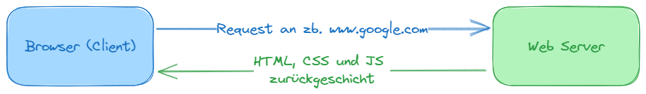
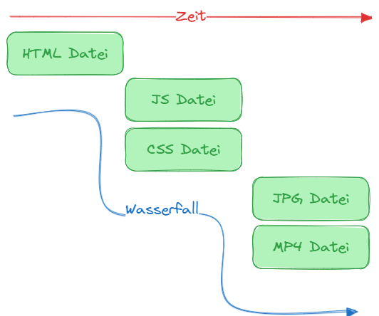
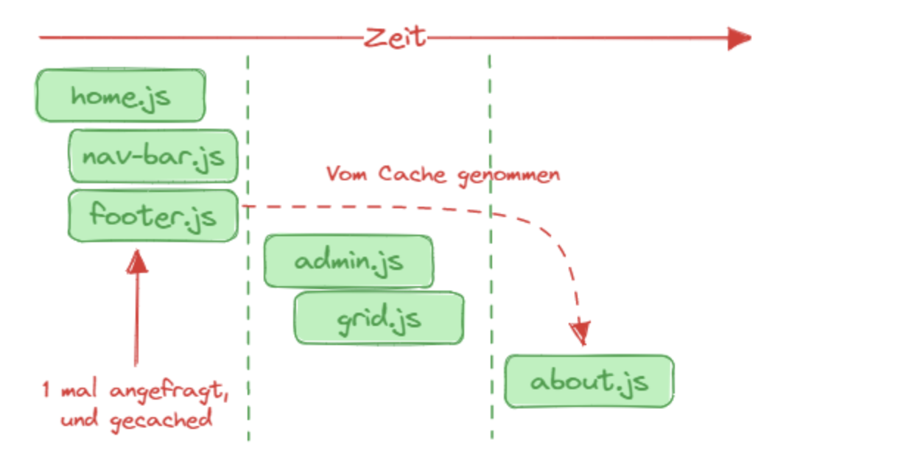
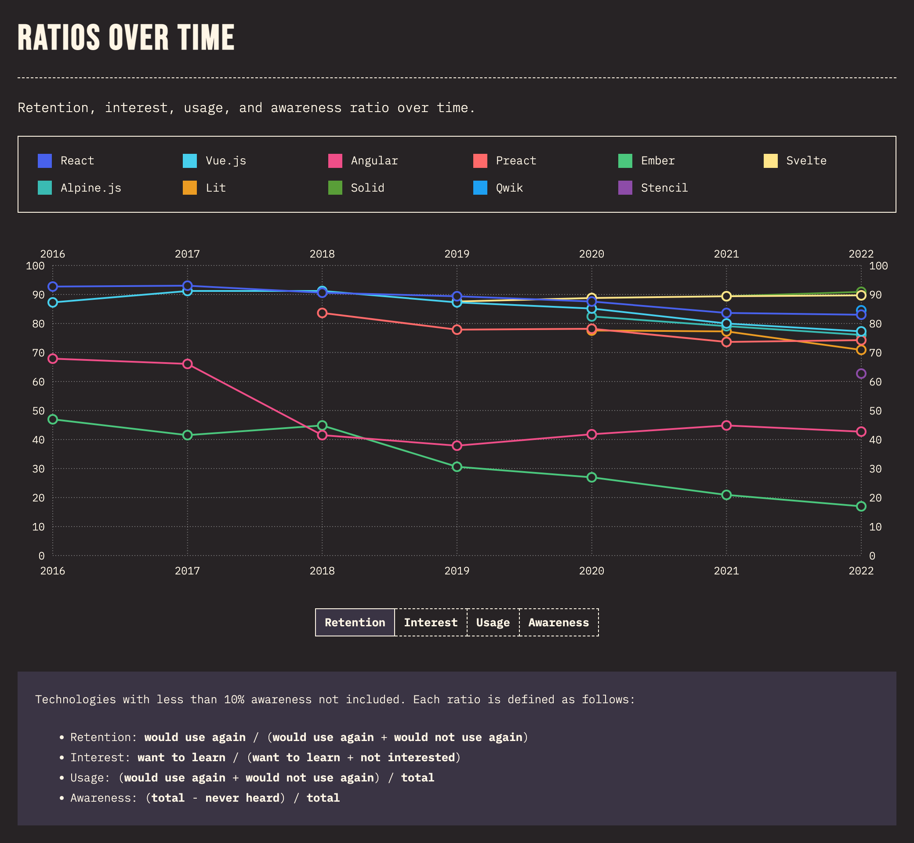
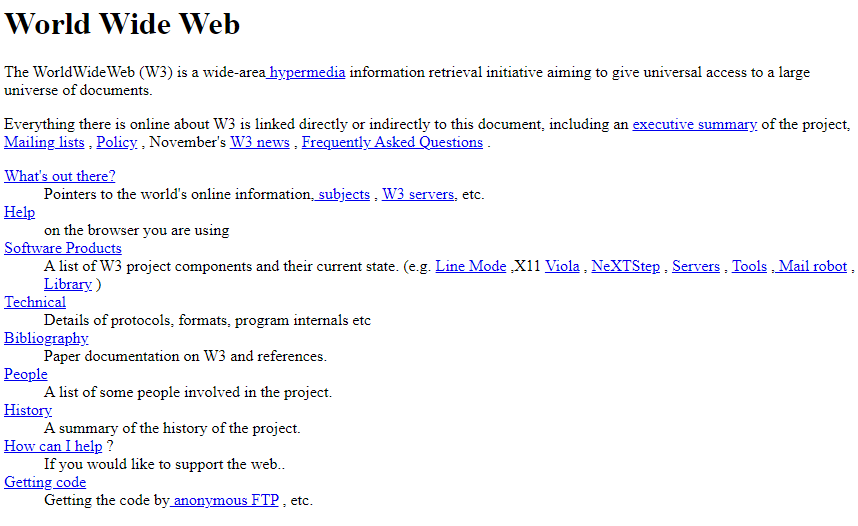
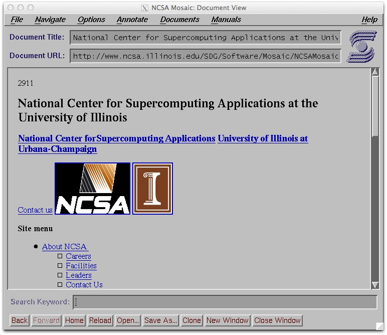

> This is based on a small workshop I gave to my colleagues at work. I thought it might be useful to share it here too.

Bevor wir in die Tiefen von React eintauchen, ist es wichtig, einige grundlegende Konzepte und Begriffe zu klären. Dieser Abschnitt bietet eine Einführung in die Welt der Webanwendungen, erläutert, warum Frontend-Frameworks so entscheidend sind und zeigt Ihnen, wie Sie am besten ein Framework wie React erlernen können.

### Web Applikationen 101

In der modernen Softwareentwicklung sind Webanwendungen allgegenwärtig. Sie sind Programme, die in einem Webbrowser laufen und mit denen Benutzer interagieren können, um bestimmte Aufgaben zu erledigen – sei es Online-Shopping, Social Media oder Cloud-Computing. Webanwendungen bestehen im Allgemeinen aus einer Frontend-Schicht, die das Benutzerinterface (UI) beinhaltet, und einer Backend-Schicht, die für die Datenverarbeitung verantwortlich ist. Beide Schichten kommunizieren in der Regel über eine API (Application Programming Interface).

### Von einer einfachen Webseite zu einer komplexen Web Applikation

Grundsätzlich ist eine Webseite traditionell nur HTML. Dann kann man CSS für das Styling und JavaScript für die UI-Logik hinzufügen. Wenn man im Browser auf eine URL geht, werden vom Webserver die HTML-, CSS- und JS-Dateien zurückgeschickt.



Die Kommunikation zwischen Client und Server erfolgt synchron, das bedeutet, dass der Client, wenn er eine Anfrage schickt, auf eine Antwort wartet.

#### Was ist ein Client? Was ist ein Server?

Der Unterschied zwischen den beiden ist, dass ein Client einen Server konsumiert und ein Server einem Client dient. Beispiele für Clients sind z.B. Browser oder cURL-Befehle, und Server sind z.B. Node.JS, Django, Spring Boot, NGINX, Apache usw. Ein Server kann aber auch ein Client sein, wenn er einen anderen Server konsumiert, wie ein Datenbankserver.

#### Was ist ein Webserver? Was ist ein Application Server?

Ein Webserver schickt Ressourcen, meist HTML, CSS und JS, welche über HTTP geschickt werden. Ein Application Server schickt jedoch mehr als nur Ressourcen, wie zum Beispiel JSON. Zusätzlich ist ein Application Server nicht zu einem Protokoll gebunden und kann das Protokoll beliebig auswählen.

#### Was passiert, wenn man zusätzliche Anfragen an einen Webserver schickt?

Eine moderne Webseite beinhaltet HTML, CSS und JS, sowie auch Icons, Videos und Bilder. All diese Ressourcen müssen dann zusätzlich vom Browser an den Webserver angefragt werden. Jedoch sind Anfragen an einen Webserver synchron, wodurch Wasserfallanfragen entstehen, oder "Waterfall requests".



Wenn alle Dateien geladen sind, wird die Webseite im Browser angezeigt.

### Web 2.0

Mit der Zeit war es nicht genug, nur statische Dateien mittels Webserver zu liefern. In Web 2.0 (ca. 2004) konnten Nutzer zum ersten Mal nicht nur den Inhalt von Webseiten lesen, sondern auch Inhalt erstellen. PHP hat vieles davon ermöglicht, da es wie ein serverseitiger Webserver ist. Dadurch wurde es möglich, dynamisch HTML-Dateien zu bearbeiten. Das bedeutet, dass der Server die HTML-Dateien selbst und automatisch ändern kann, ohne dass jemand manuell eingreifen muss, z.B. wenn jemand einen neuen Blogpost in einer Datenbank erstellt. Das nennt man Server-side Rendering.

Templating-Engines in verschiedenen Programmiersprachen wurden verwendet, um komplexen Code innerhalb von HTML einzubauen. Beispiele sind Twig für PHP, JSP für Java oder Django für Python.

### SPA - Single Page Applications

Während der Zeit von Server-Side Rendering wurde nur sehr wenig JavaScript verwendet, hauptsächlich für kleine DOM (Document Object Model) Manipulationen und Animationen. jQuery war dafür die beliebteste Bibliothek.

Jedoch wurde es mit der Zeit mehr und mehr möglich, ganze Applikationen in JavaScript zu schreiben, dank Bibliotheken wie Knockout.js, Ember.js, Angular.js oder React.js. Diese ermöglichten die Entwicklung sogenannter Single-Page Applications.

Mit SPAs müssen nur zwei Anfragen geschickt werden: für HTML und für JS. Keine weiteren für zusätzliche Links.

Das bedeutet, es gibt keine `/home` und `/about` HTML-Dateien, sondern nur eine einzige `index.html` Datei. Wenn dann `/home` aufgerufen wird, ändert JavaScript die `index.html` Datei so, dass sie wie die `/home` HTML-Datei aussieht.

Das erfolgt so:

```html
<!DOCTYPE html>
<html>
  <head>
    <title>Index HTML Datei, welche React ausführt</title>
  </head>
  <body>
    <div id="app"></div>
    <script src="./bundle.js"></script>
  </body>
</html>
```

Dann übernimmt React so:

```js
import * as React from 'react';
import ReactDOM from 'react-dom';

const title = 'Webseite Titel';
ReactDOM.render(
  <div>{title}</div>,
  document.getElementById('app')
);
```

In diesem Fall sieht man eine Art Templating, wie vorher, jedoch diesmal im Client statt am Server. Solche Applikationen werden Client-Side Rendered Applications genannt, welche es möglich gemacht haben, SPAs zu erstellen.

#### Wie ist Routing möglich in SPAs?

Natürlich ist dann Server-side Routing nicht mehr möglich, deswegen verwenden SPAs Client-Side Routing. Die JavaScript-Datei hat alle Seiten einer Webseite mittels eines Templates in JS (z.B. JSX für React-Applikationen). Wenn Routing erforderlich ist, wird dies nur scheinhaft durchgeführt mittels JavaScript. Es wird am Client selbst das DOM so manipuliert, dass es wie eine neue Webseite aussieht.

#### Werden dann nicht die JS-Dateien enorm groß?

Kurzgefasst: Ja. Die JavaScript-Dateien werden natürlich ziemlich groß, weil sie viel mehr Last übernehmen. Das bedeutet auch, dass ein Webserver größere Dateien schicken muss und der Browser auch größere Dateien erhalten muss, was natürlich zu einer Netzwerklatenz führt.

Um dieses Problem zu lösen, wird der Code gespalten (Lazy Loading in React), wobei nur Teile des JavaScripts geladen werden, die gerade gebraucht werden für die momentane Seite. Wenn eine andere Seite aufgerufen wird, dann schickt der Webserver neue JavaScript-Dateien für die Seite.

Aber ist es dann noch ein SPA? Und sind wir dann nicht zurück zum Wasserfall-Prinzip?

Nicht ganz. Durch Code-Splitting wird nicht jede einzelne Seite getrennt, sondern jede Komponente. Das bedeutet, wenn Komponenten seitenübergreifend gleich bleiben, dann gehen sie in den Cache. Nur der neue Content von Seiten wird neu geladen.



Das Problem jetzt ist, wenn sich etwas ändert, sieht der Kunde noch nichts, weil alles gecached ist. Bei jedem Update würde der Kunde nichts Neues sehen. Als Lösung dazu bekommt jede einzelne JS-Datei einen neuen Namen nach jedem Build basierend auf TimeStamps (z.B. grid.hash123.js wird umbenannt auf grid.hash456.js). Dadurch ist bekannt, welche Dateien im Cache veraltet sind und welche nicht.

## Einführung in React

> In diesem Abschnitt werden wir einen ersten Blick auf React werfen, ein JavaScript-Framework, das sich großer Beliebtheit erfreut. Wir werden uns die Gründe für die Verwendung von React ansehen, einen kurzen Überblick über seine Geschichte geben und die Hauptmerkmale dieses mächtigen Tools erläutern.

Unterpunkte:
- [Was ist React?](#was-ist-react)
- [Warum React?](#warum-react)
- [Der Zustand von React heute](#der-zustand-von-react-heute)

React ist eine essenzielle Technologie, die in einer Vielzahl von Anwendungsfällen eine Rolle spielt, von Single-Page-Webanwendungen bis hin zu komplexen Unternehmenssystemen.

### Was ist React?

React ist eine leistungsstarke JavaScript-Bibliothek, die ursprünglich von Facebook entwickelt wurde und heute von einer breiten Community von Entwicklern unterstützt wird. Es ermöglicht das Erstellen von Web-Anwendungen durch den Einsatz von modularen Code-Einheiten, bekannt als "Komponenten". Diese Komponenten sind die Bausteine einer React-Anwendung und repräsentieren sowohl UI-Elemente als auch Logik.

#### Geschichte von React

React wurde 2013 von Facebook als Reaktion auf die Bedürfnisse schneller, komplexer und interaktiver Benutzeroberflächen veröffentlicht. Facebook selbst war eines der ersten großen Projekte, die React nutzten, gefolgt von Instagram im Jahr 2014. Die rasante Annahme von React ist zum Teil auf seine Fähigkeit zurückzuführen, Entwicklern ein höheres Maß an Flexibilität und Effizienz zu bieten, insbesondere in großen Anwendungen.

### Warum React?

React bietet zahlreiche Vorteile, die es zu einer attraktiven Wahl für viele Projekte machen.

#### Leistung

React verwendet ein virtuelles DOM, um Änderungen an der Benutzeroberfläche effizient zu verwalten. Dies minimiert die Anzahl der erforderlichen DOM-Manipulationen und erhöht somit die Leistung.

Mehr über das Virtuelle DOM kommt später.

#### Flexibilität und Modularität

Dank seines komponentenbasierten Ansatzes können Entwickler Code wiederverwenden und dadurch Entwicklungszeit und -aufwand reduzieren. Komponenten können isoliert entwickelt und getestet werden, was auch die Wartbarkeit des Codes verbessert.

#### Starkes Ökosystem

React ist mehr als nur eine Bibliothek; es ist ein ganzes Ökosystem. Zahlreiche Zusatzbibliotheken wie Redux für State-Management und React Router für das Routing in Single-Page-Applications ergänzen die Kernbibliothek. Darüber hinaus gibt es eine Vielzahl von Entwicklerwerkzeugen, Community-Ressourcen und Tutorials, die den Einstieg erleichtern.

React hat eine der aktivsten und engagiertesten Entwicklergemeinschaften. Es gibt zahlreiche Meetups, Konferenzen und Online-Ressourcen, die ständig aktualisiert werden.

#### Der Zustand von React heute

Seit seiner Einführung hat sich React ständig weiterentwickelt und ist heute eine der meistgenutzten Bibliotheken für die Webentwicklung. Der Zustand von React im aktuellen Software-Ökosystem ist geprägt von kontinuierlichen Verbesserungen, der Aktualisierung bestehender Funktionen und der Einführung neuer Konzepte.

Momentan sind ungefähr 12 Millionen Webseiten entweder komplett oder teilweise mit React als UI-Framework gebaut. Das sind ca. 4.1% aller Webseiten, die JavaScript verwenden, oder 3.3% aller Webseiten.

Zusätzlich verwenden 42.63% aller Webentwickler React in ihren Projekten weltweit. Die meisten React-Webseiten kommen aus den USA, mit ca. 2.3 Millionen Webseiten. Deutschland hat ca. 250 Tausend Webseiten, die mit React erstellt wurden.

Zahlen aus der Entwicklerumfrage 2023, erhoben von [Statista](https://www.statista.com/statistics/1124699/worldwide-developer-survey-most-used-frameworks-web/).

#### Beliebtheit und Marktanteil

React hat einen beträchtlichen Marktanteil und wird von zahlreichen Fortune-500-Unternehmen sowie Startups gleichermaßen genutzt. Die Jobmarkt-Daten spiegeln dies wider; die Nachfrage nach React-Entwicklern ist hoch.

Momentan sind ca. 45,000 Webseiten live in Österreich, die mit React gebaut wurden.

Top Firmen, die React verwenden:
- [Meta / Facebook](https://about.meta.com/)
- [Uber und Uber Eats](https://www.uber.com/at/en/)
- [Airbnb](https://www.airbnb.com/)
- [Netflix](https://www.netflix.com)
- [Dropbox](https://www.dropbox.com/)

Und viele mehr...

#### Aktuelle Version und Updates

React folgt einem strukturierten Veröffentlichungszyklus mit regelmäßigen Updates. Diese Updates bringen oft Performance-Verbesserungen, neue Features und verbesserte Entwicklerwerkzeuge mit sich.

Die neueste stabile Version ist React v18.0, welche wir auch verwenden und lernen werden. Sie wurde im März 2022 veröffentlicht.

React ist Open Source und hat dadurch viele Entwickler, die daran eigenständig arbeiten. Jedoch arbeitet ein festes Team von Meta auch aktiv und ständig daran. Einige Sachen, woran das Team momentan arbeitet, sind:
- React Server Components
- Asset Loading
- Document Metadata
- React Compiler optimieren
- Off-Screen Rendering
- Transition Tracing

Mehr dazu hier [auf ihrem Blog](https://react.dev/posts/2023/03/22/react-labs-what-we-have-been-working-on-march-2023).

#### Konkurrenz und Vergleiche

Während React weit verbreitet ist, gibt es andere ähnliche Technologien wie Angular und Vue.js. Jede dieser Technologien hat ihre eigenen Stärken und Schwächen, aber React hat sich durch seine Flexibilität und das starke Community-Engagement abgehoben.



#### Community und Ökosystem

Nicht zuletzt ist die Community rund um React lebendig und aktiv. Zahlreiche Open-Source-Projekte, Tutorials, Konferenzen und Online-Foren ermöglichen einen schnellen Wissensaustausch und fördern die Weiterentwicklung der Technologie.

Durch die Kombination dieser Faktoren befindet sich React in einer starken Position und bleibt ein Schlüsselakteur in der Zukunft der Webentwicklung.

---

## JavaScript und TypeScript Refresher

Bevor wir uns intensiver mit React befassen, ist es sinnvoll, unser Wissen über JavaScript und TypeScript aufzufrischen. In diesem Abschnitt werden wir die Grundlagen dieser beiden eng verwandten Sprachen durchgehen und ihre jeweiligen Vor- und Nachteile beleuchten.

### Kurze Geschichte von JavaScript

Der erste Webbrowser wurde von Tim Berners-Lee im Jahr 1990 in der Schweiz entwickelt. Jedoch war er noch unbekannt.



Im Jahr 1993 wurde der erste Mainstream-Browser an der Universität von Illinois entwickelt. Er wurde Mosaic genannt und zuerst nur für Unix-Systeme veröffentlicht. Jedoch gab es da noch kein JavaScript. Es hatte nur ein DOM, und das war auch noch nicht standardisiert.



Nach dem Mosaic-Projekt hat einer der Techniker, namens Marc Andreessen, eine Firma gegründet namens Netscape.

Netscape wollte einen Browser erstellen, der dynamischer ist. Um es dynamischer zu machen, wollten sie zuerst Java verwenden, jedoch hat es nicht gepasst. Als Plan B haben sie Brendan Eich, einen Softwareentwickler von Netscape, im Jahr 1995 beauftragt, eine neue Scripting-Sprache zu designen, die etwas Java ähneln sollte.

Nach nur 10 Tagen Entwicklung wurde Mocha erschaffen. Sie hatte eine Syntax wie Java, jedoch mit folgenden Unterschieden:
- First Class Functions (wie Scheme) - Funktionen sind wie Variablen
- Dynamic Typing (wie Lisp) - Datentypen von Variablen können sich ändern
- Prototype Inheritance (wie Self) - Verlinkung von einem Parent-Objekt zu einem Child-Objekt `child.__proto__ = parent`

Mit der Veröffentlichung von Netscape Navigator wurde Mocha in JavaScript umbenannt. Zu dieser Zeit hat Microsoft den Internet Explorer entwickelt, und da sie auch eine Version von JavaScript wollten, haben sie es nachgebaut, ohne Recht, und dann JScript genannt.

Mit dem Aufstieg des Webs musste dann eine standardisierte JavaScript-Version erstellt werden, sodass nicht jeder Browser seine eigene Script-Art hat. Dafür hat die European Computer Manufacturing Association (ECMA) im Jahr 1997 eine standardisierte Version erstellt.

### Warum TypeScript?

Das Ziel von TypeScript ist es, die Fehler von JavaScript auszubessern. Es ist eine Open-Source-Programmiersprache, die auf JavaScript aufbaut, und aber auch zurück auf JavaScript kompiliert.

TypeScript wurde bei Microsoft von Anders Hejlsberg entwickelt und im Jahr 2012 veröffentlicht.

Der größte Vorteil von TypeScript ist die Abschaffung von Dynamic Typing und das Kompilieren für alle Browser. Jedoch ist TypeScript nur beliebt geworden mit der Erstellung von besseren IDEs. Entwicklungsumgebungen wie Visual Studio Code (auch von Microsoft) haben TypeScript-Support integriert und benutzen den TS-Compiler für Error Checking und Code Completion. Zusätzlich ermöglicht der Compiler ein leichteres Refactoring durch fortgeschrittene IDEs.

Letztendlich ist TypeScript durch die strikteren Regeln wartbarer und skalierbarer, was sich sehr für größere Projekte eignet.

Jede JavaScript-Datei ist auch eine TypeScript-Datei. Das bedeutet, dass es möglich ist, jede JavaScript-Bibliothek auch in TypeScript-Projekten zu importieren.

### Relevanz von TypeScript heute

Heute ist TypeScript eine der beliebtesten und meistbenutzten Programmiersprachen, und es wächst jedes Jahr.

Der Grund, warum TypeScript so relevant ist und weiterhin relevant bleiben wird, ist, dass es sich nach den Standards der ECMA richtet und die Features beinhaltet, die noch nicht von jedem Browser unterstützt werden. Kurzgefasst: TypeScript ist der neue Standard.

Die Verwendung von TypeScript wird von vielen Bibliotheken und Frontend-Frameworks unterstützt, ohne Probleme. Angular unterstützt beispielsweise nur TypeScript.

## Erstes React Projekt

### Ein erstes Beispiel

```html
<!DOCTYPE html>
<html lang="de">
<head>
  <meta charset="UTF-8">
  <title>Erstes React Projekt</title>
  <!-- React Bibliotheken über CDN einbinden -->
  <script src="https://unpkg.com/react@17/umd/react.production.min.js"></script>
  <script src="https://unpkg.com/react-dom@17/umd/react-dom.production.min.js"></script>
  <!-- Babel einbinden, um JSX zu transpilieren -->
  <script src="https://unpkg.com/@babel/standalone/babel.min.js"></script>
</head>
<body>
  <!-- Wurzelelement für unsere React-Anwendung -->
  <div id="root"></div>

  <script type="text/babel">
    // Ihr React-Code kommt hier
    const element = <h1>ABK9</h1>;
    ReactDOM.render(element, document.getElementById('root'));
  </script>
</body>
</html>
```

### Verwenden von `create-react-app`

`create-react-app` ist ein CLI-Tool, das von Facebook entwickelt wurde und die Einrichtung eines neuen React-Projekts erheblich erleichtert. Im Gegensatz zur Arbeit mit einem CDN bietet `create-react-app` eine umfangreiche Umgebung mit vielen Features.

- Ein gut organisierter Projektordner und -struktur
- Vorinstallierte Tools für Entwicklungs- und Produktionsumgebung
- Einfaches Hinzufügen von Drittanbieter-Bibliotheken über npm oder yarn
- Enthält bereits einen Development-Server

#### Wie man es verwendet

Im Terminal:

```shell
npx create-react-app abk9
cd abk9
npm start
```

Das erstellt ein neues Verzeichnis namens `abk9`, installiert alle nötigen Abhängigkeiten und startet den Development-Server.

### Projektstruktur

Nachdem Sie `create-react-app` ausgeführt haben, erhalten Sie eine vordefinierte Verzeichnisstruktur.

- `public/`: statische Dateien und das HTML-Skelett
- `src/`: der Quellcode Ihrer App
- `package.json`: enthält Informationen über Ihr Projekt und Abhängigkeiten
- `node_modules/`: alle installierten Pakete

Im `src`-Ordner finden Sie die Hauptkomponente `App.js`, die Sie als Ausgangspunkt für Ihre eigene App verwenden können.

---

Quellen:
- [Geschichte von JavaScript](https://web.archive.org/web/2023/https://launchschool.com/books/javascript/read/introduction) (Original offline, daher über das Internet Archive)
- [The Weird history of JS](https://www.youtube.com/watch?v=Sh6lK57Cuk4&ab_channel=Fireship)
- [A Brief History of JavaScript](https://www.youtube.com/watch?v=qKJP93dWn40&ab_channel=freeCodeCamp.org)
- [Erste Webseite](http://info.cern.ch/hypertext/WWW/TheProject.html)
- [Geschichte von TypeScript](https://invedus.com/posts/what-is-typescript-definition-history-features-and-uses-of-typescript/#:~:text=Anders%20Hejlsberg%20created%20TypeScript%20in,did%20not%20wholly%20adopt%20it.)
- [Relevanz von TypeScript](https://css-tricks.com/the-relevance-of-typescript-in-2022/)
