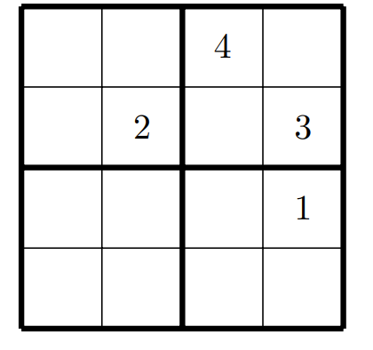
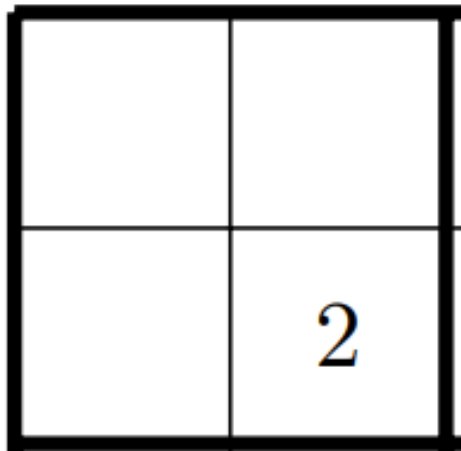
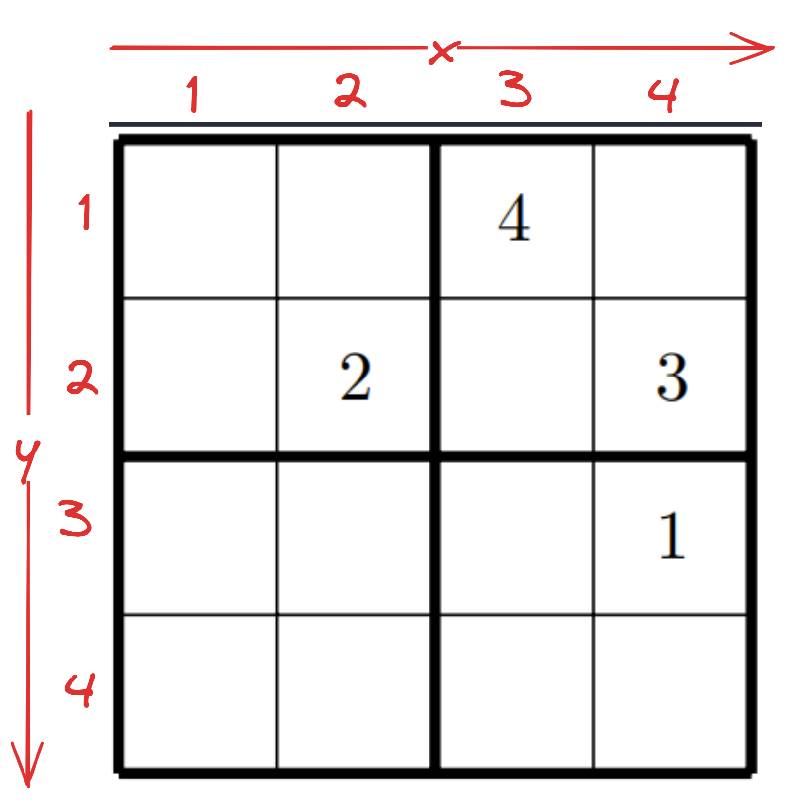
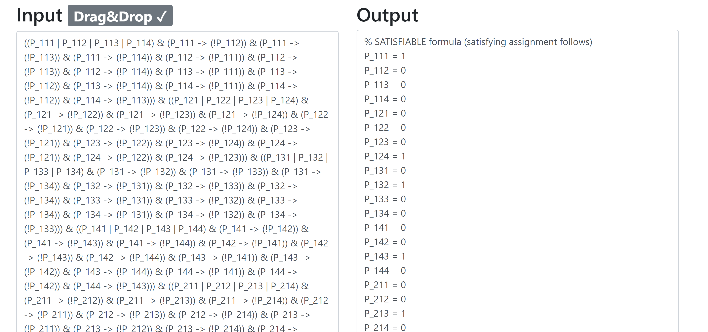
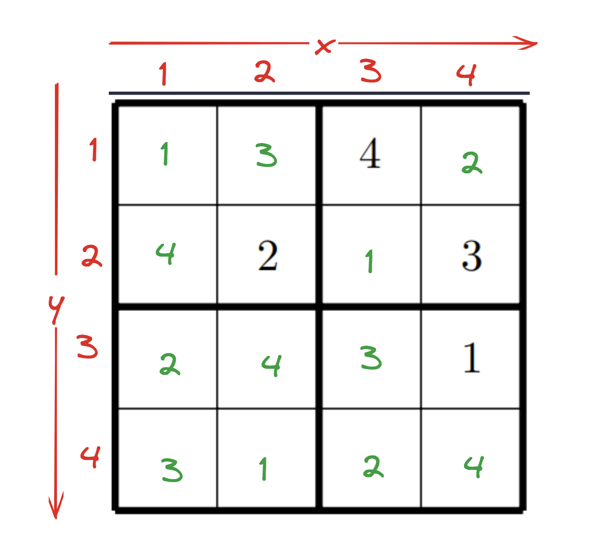

The Goal is to solve a simple 4x4 sudoku using Propositional logic.



## Step 1: Define Propositional Variables

In a Sudoku puzzle, you're working with a grid of cells, each of which can contain a number. In a 4x4 Sudoku, each cell can have one of four numbers: 1, 2, 3, or 4.

To solve this using propositional logic, we represent the state of each cell with a set of logical variables. These variables will answer the question: "Does this cell contain this number?"

### Defining Variables

Imagine your Sudoku grid as a 4x4 matrix of cells. Each cell is identified by its row and column number.

For each cell, you'll create variables that represent whether the cell contains a specific number.

Since there are four possible numbers (1 to 4), each cell will have four associated variables.

These variables are Boolean, meaning they can be either true or false.

## Step 2: Defining the Constraints

### The Cell Constraint

#### Conceptualizing the Constraint

Imagine a simpler scenario, where you have a box that can contain one and only one of three objects: a pen, a pencil, or an eraser. Now, let's create propositional variables to represent the presence of each object in the box:

- $P$ for a pen.
- $C$ for a pencil.
- $E$ for an eraser.

**At Least One Object:**
First, we want to say that at least one object is in the box. This can be done using the "or" operator:

- $P ∨ C ∨ E$

This statement is true if there's at least a pen, or a pencil, or an eraser in the box.

**Exactly One Object:**

To ensure that there is exactly one object, we need additional constraints. These will state that if one object is in the box, the others are not. For example:

- $P → ( ¬C ∧ ¬E)$

If there's a pen (P is true), then there cannot be a pencil or an eraser.

Apply the same logic for a pencil and an eraser:

- $C→(¬P∧¬E)$
- $E→(¬P∧¬C)$

These statements use the "implies" ($→$) operator, meaning if the first part (e.g., $P$) is true, then the second part (e.g., $¬C∧¬E$) must also be true.

**Completing the constraint**

So if we put all three constraints together, we get:

$(P→(¬C∧¬E))∧(C→(¬P∧¬E))∧(E→(¬P∧¬C))$

#### Back to the actual Problem

Now, we almost have our Solution. We have the difference then, that we have 4 possible answers, and only one of them can be true. This means, if $3$ is true for the cell $P_{x,y}$, we would have:

- $P_{x,y,3} → ( ¬P_{x,y,1} ∧ ¬P_{x,y,2} ∧ ¬P_{x,y,4})$

In addition however, we need to also ensure that each cell has at least one true value with the constraint:

- $P_{x,y,3} ∨ P_{x,y,1} ∨ P_{x,y,2} ∨ P_{x,y,4}$

Meaning, for a single cell, to ensure that 1 and only 1 value is inside it, this would be the formula:

$$
\begin{aligned}
& (P_{x,y,3} ∨ P_{x,y,1} ∨ P_{x,y,2} ∨ P_{x,y,4}) \\
& ∧ ((P_{x,y,3} → ( ¬P_{x,y,1} ∧ ¬P_{x,y,2} ∧ ¬P_{x,y,4})) \\
& ∧ (P_{x,y,1} → ( ¬P_{x,y,3} ∧ ¬P_{x,y,2} ∧ ¬P_{x,y,4})) \\
& ∧ (P_{x,y,2} → ( ¬P_{x,y,3} ∧ ¬P_{x,y,1} ∧ ¬P_{x,y,4})) \\
& ∧ (P_{x,y,4} → ( ¬P_{x,y,3} ∧ ¬P_{x,y,1} ∧ ¬P_{x,y,2}))
\end{aligned}
$$

That's a mouthful...

### The Row and Column Constraint

The constraints for rows and columns in Sudoku ensure that no number is repeated in any row or column. Here's how you can think about formulating these constraints:

#### The Concept

For each number and each row, ensure the number appears only once in that row.

Consider the number 1 in the first row. You need to ensure that if 1 is in one cell of the row, it is not in any other cell of that row.

This would mean, if $P_{1,1,1}$ is true, then $P_{1,2,1}$, $P_{1,3,1}$ and $P_{1,4,1}$ cannot be true. And this must be the case for every single cell in the row.

This concept applies to the column too. However with the difference that the $x$ value shifts.

Let's use a simple example to illustrate the approach without giving the actual Sudoku solution:

#### Example

Imagine you have a sequence of three boxes, and you want to ensure that a red ball is in only one of them.

Let's denote the presence of a red ball in each box as $R1$, $R2$, and $R3$.

The Constraints would be:
- $R1→(¬R2∧¬R3)$
- $R2→(¬R1∧¬R3)$
- $R3→(¬R1∧¬R2)$

These constraints ensure that if the red ball is in one box, it cannot be in the others.

#### Back to the Problem

In our case, we have 4 "boxes" (i.e. cells). This would be $P_{x,1,n}$, $P_{x,2,n}$, $P_{x,3,n}$, $P_{x,4,n}$ for our rows, and $P_{1,y,n}$, $P_{2,y,n}$, $P_{3,y,n}$, $P_{4,y,n}$ for our columns.

This would give us the constraints:

- $P_{x,1,n}→(¬P_{x,2,n}∧¬P_{x,3,n}∧¬P_{x,4,n})$
- $P_{x,2,n}→(¬P_{x,1,n}∧¬P_{x,3,n}∧¬P_{x,4,n})$
- $P_{x,3,n}→(¬P_{x,2,n}∧¬P_{x,1,n}∧¬P_{x,4,n})$
- $P_{x,4,n}→(¬P_{x,3,n}∧¬P_{x,2,n}∧¬P_{x,1,n})$

And the same for the column, but with x and y switched. (I'm not gonna put that into latex...)

This also has to be applied to every number. So the first constraint, for every cell has to be true, and the column and row constraint needs to be full, and lastly also for every 2x2 grid. So lets get to that now:

### 2x2 Constraint

A 2x2 grid is very similar to our columns and rows.

This means, if we take the 2x2 grid: (1, 1), (1,2), (2,1), (2,2), which would be this one:



The Constraint would be very simple:

- $P_{1,1,n}→(¬P_{1,2,n}∧¬P_{2,2,n}∧¬P_{2,1,n})$
- $P_{1,2,n}→(¬P_{1,1,n}∧¬P_{2,1,n}∧¬P_{2,2,n})$
- $P_{2,1,n}→(¬P_{1,2,n}∧¬P_{1,1,n}∧¬P_{2,2,n})$
- $P_{2,2,n}→(¬P_{1,1,n}∧¬P_{1,2,n}∧¬P_{2,1,n})$

## Encoding our Sudoku

First we need to put our sudoku into the language of propositional logic. For that, lets say the x axis goes from left to right and the y axis from up to down. Meaning, our grid would look like this:



#### Encoding the given values

With this declaration, we can therefore say:

- $P_{2,2,2} = \top$
- $P_{3,1,4} = \top$
- $P_{4,2,3} = \top$
- $P_{4,3,1} = \top$

And All other Variables are unknown.

### Encoding the Constraints

Now we need to look at our constraints. Generally speaking, we have 64 values, 4 columns, 4 rows and 4 2x2 grids.

Now this is a lot of constraints. So lets write a python program for that.

We will  use [limboole from the JKU.](https://fmv.jku.at/limboole/) This means we have to respect their syntax, when encoding propositional formulas.

```bnf
expr ::= iff
iff ::= implies { '<->' implies }
implies ::= or [ '->' or | '<-' or ]
or ::= and { ('|' | '/') and }
and ::= not { '&' not }
not ::= basic | '!' not
basic ::= var | '(' expr ')'
```

If we then put the Formula into limboole, and check for satisfiability, we get the following:



Now the moment of truth. Putting the solution into the sudoku. Remember, all the variables with the 1 are true. So lets see:



I went into this thinking that there must have been something wrong. Either with my logic or my code. But I guess not. I am so happy right now that this worked!

## Conclusion

I really enjoyed solving this. In a way, this is an artificial intelligence too. Before this, I thought that propositional Logic wasn't very sophisticated and not complex enough to solve problems. Seems like I was wrong.

This project really opened my eyes to the power of logic and expressing problems in it. I would recommend anyone interested in AI to learn AI and try to solve problems with it.

---

Extra resources:
- [limboole - JKU](https://fmv.jku.at/limboole/)
